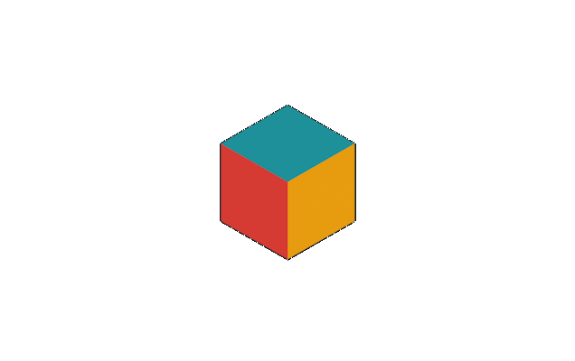
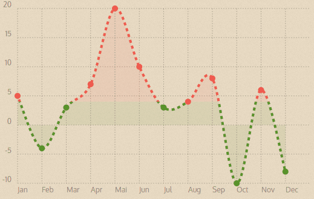
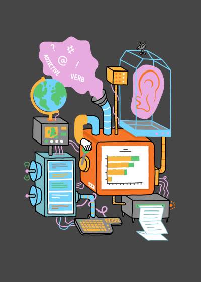

---
framework   : impressjs        # {io2012, html5slides, shower, dzslides, ...}
highlighter : highlight.js  # {highlight.js, prettify, highlight}
hitheme     : tomorrow      # 
widgets     : []            # {mathjax, quiz, bootstrap}
mode        : selfcontained # {standalone, draft}

--- #title x:30 y:0 z:9500 scale:10

--- x:-1200 z:5000
## An Analyst's Toolbox & The Inclusion of R

  
  
- Author: Ali Arsalan Kazmi  
- Date: 9th April, 2015

--- x:-200 z:1000
 

Tools determine:
 
&mdash; What
 
&mdash; How
 
&mdash; & by When
 
goals can be accomplished...

--- x:-200 z:-3000

--- x:-1500 z:-7000

Tools may be: 
 
&mdash; incorrectly utilised
 
&mdash; under-utilised
 
&mdash; over-utilised

--- x:0 y:3000 z:100

--- x:-1500 y:0 z:-10000

All tools are built to remedy certain problems...

--- x:-1500 y:800 z:-10000

What problems do we remedy using our tools at AIMIA?

--- x:-1500 y:0 z:-20000

--- x:-1500 y:200 z:-20000

Tool No. 1: Automation

--- x:-500 y:0 z:-20000

--- x:-500 y:180 z:-20000

Tool No. 2: Reproducibility

--- x:1000 y:0 z:-20000

--- x:1000 y:200 z:-20000

Tool No. 3: Visualisation

--- x:1000 y:980 z:-20000

How could we implement these?

--- x:1000 y:980 z:-28000

--- x:1000 y:1280 z:-50000

Why R?

--- x:1000 y:1980 z:-50000

- By (mostly) Statisticians, for Statisticians, of Statisticians  
- Programming: Functional and Object Oriented (i.e. Structured)  
- Continuously Improved  
- Free to use & modify

--- x:1000 y:4000 z:-50000

An Analyst's Workflow

--- x:1700 y:4000 z:-50000

--- x:3000 y:4000 z:-50000

Problems at each stage can be cured with tools...

 

--- x:2000 y:4000 z:-90000

